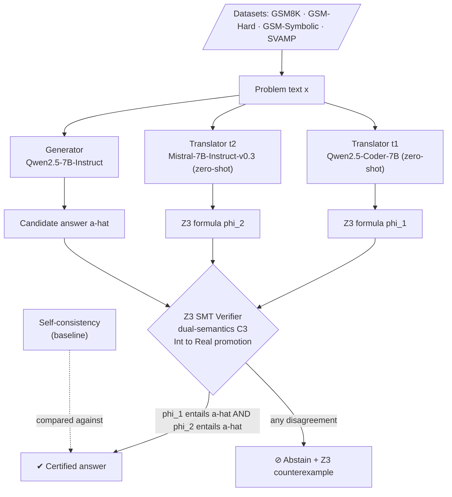

<div align="center">

# Certified Selective Reasoning

### Decorrelated Neuro-Symbolic Verification with Distribution-Free Safety Guarantees

*A verification layer that lets a language model know **when to answer** — issuing a machine-checkable certificate when it does, and abstaining with a counterexample when it can't.*

<br/>


</div>

---

> **The problem in one sentence.** Large language models are frequently *confidently wrong* on mathematical reasoning — and a wrong answer delivered with high confidence is far more dangerous than an honest "I don't know."
>
> **The idea in one sentence.** If you translate a problem into formal logic using **two autoformalizers drawn from different model families** and demand that *both* independently entail the generator's answer, the correlated errors that quietly defeat single-translator verifiers stop lining up — and the confident-wrong rate collapses toward zero.
>
> **The headline finding.** On GSM-Symbolic, single-translator verification leaves a residue of confident-wrong answers (Coder-only: 8; Mistral-only: 2). The **cross-family AND-rule drives that to 0** — at the deliberate cost of coverage, which is exactly the selective-prediction knob we want to expose and bound.

---

## Table of Contents

- [Motivation: the confident-wrong problem](#motivation-the-confident-wrong-problem)
- [Core idea: decorrelated redundancy](#core-idea-decorrelated-redundancy)
- [Pipeline architecture](#pipeline-architecture)
- [Key results](#key-results)
- [Ablations and negative results](#ablations-and-negative-results)
- [Theoretical framing](#theoretical-framing)
- [Repository structure](#repository-structure)
- [Installation](#installation)
- [Usage: the two-stage workflow](#usage-the-two-stage-workflow)
- [Datasets](#datasets)
- [Reproducibility and engineering notes](#reproducibility-and-engineering-notes)
- [Roadmap](#roadmap)
- [Related work](#related-work)
- [Limitations and honest caveats](#limitations-and-honest-caveats)
- [Citation](#citation)
- [Contact](#contact)

---

## Motivation: the confident-wrong problem

Selective prediction asks a model to answer only when it is likely to be right, and to abstain otherwise. For high-stakes reasoning, the metric that matters is not accuracy but the **confident-wrong (CW) rate**: the fraction of *answered* problems on which the system commits to an incorrect answer. A deployable reasoning system should be able to make the CW rate arbitrarily small and *prove* it, trading coverage for safety in a controlled way.

Purely probabilistic confidence signals — softmax scores, self-consistency, learned verifiers — are calibrated, at best, only on-distribution and offer no hard guarantee. This project takes a complementary route: **certify each answer symbolically**. We autoformalize the natural-language problem into an SMT formula and ask a solver (Z3) whether the candidate answer is *entailed* by that formula. When it is, we emit a certificate; when it isn't, we abstain and return the solver's counterexample as a legible reason.

The catch — and the research contribution — is that a symbolic certificate is only as trustworthy as the **translation** that produced it. A single autoformalizer that misreads the problem will produce a formula that faithfully "certifies" the misreading. The central question of this work is therefore:

> **How do we make the translation layer trustworthy enough that a symbolic certificate becomes a genuine safety signal — with guarantees that hold under distribution shift?**

---

## Core idea: decorrelated redundancy

The thesis is **certified selective prediction via decorrelated redundancy**, and it rests on a single observation confirmed repeatedly in our data:

> **Single-translator verification is structurally blind to correlated errors.** When the generator misreads a problem, a same-family translator tends to misread it *the same way*. The formula then entails the wrong answer, and the verifier passes the error through — sometimes at *worse-than-chance* rates, because the very features that fool the generator fool its sibling translator too.

The remedy borrows from **N-version programming**: run independent implementations built by different teams and require agreement. Here, the "implementations" are autoformalizers from **different model families**, and the "agreement" is a logical **AND-rule** — an answer is certified only if *every* translator's formula independently entails it.

Two design facts make this clean:

1. **The translators never see the generator's answer.** Each translator's Z3 formula depends only on the problem text `x`. Generation and translation are fully independent, which is what lets their errors be *decorrelated* rather than merely re-checked.
2. **Cross-family beats same-model k-way.** Adding more samples from the *same* family does not reduce CW, because errors correlate *within* a family (confirmed on GSM-Hard). The decorrelation must come from architectural/data diversity across families — not from repetition.

The AND-rule is thus a knob: as we add decorrelated translators, coverage falls but the surviving certificates are backed by an increasingly independent quorum, and the CW rate falls with it. The empirical decorrelation finding is the seed; the theoretical program (below) is to turn "falls" into a *distribution-free bound*.

---

## Pipeline architecture



**Stage 1 — Generation (GPU).** A single generator (`Qwen2.5-7B-Instruct`) and two independent zero-shot translators (`Qwen2.5-Coder-7B`, `Mistral-7B-Instruct-v0.3`) run over the problem set. Because translation is answer-independent, we make **5 LLM passes** (1 generator + 2 translators, each optionally multi-sampled) rather than a 3×2 cross-product — every downstream ablation reuses these cached outputs. Raw outputs are checkpointed to JSONL.

**Stage 2 — Verification and metrics (CPU).** The Z3 verifier consumes cached formulas, applies the **dual-semantics C3 check** (with `Int→Real` promotion and an answer-variable fallback), and computes coverage / CW / calibration under any decision rule (single-translator, AND-rule, self-consistency). Stage 2 is *free*: verifier and metric changes require **no regeneration**, so ablations are cheap and fast.

**Baseline.** Self-consistency over the generator provides a probabilistic point of comparison, isolating what the symbolic certificate adds on top of majority voting.

---

## Key results

> **Reading the tables.** *Coverage* = fraction of problems answered (not abstained). *CW* = confident-wrong count among answered problems. The design intent is **low CW at a chosen coverage**, not maximal coverage. All operating points should be — and increasingly are — reported with Wilson confidence intervals; small covered sets have wide intervals (see [Limitations](#limitations-and-honest-caveats)).

### 1. The decorrelation finding — GSM-Symbolic (n = 200)

| Configuration | Coverage | Confident-Wrong | Reading |
|---|---:|---:|---|
| Coder-only (`t₁`) | 56% | **8** | High coverage, correlated errors survive |
| Mistral-only (`t₂`) | 18% | **2** | Conservative alone, still non-zero CW |
| **Cross-family AND-rule** | **14%** | **0** | **Correlated errors broken — core result** |

This is the paper's central empirical claim in one row: two single-translator verifiers each leak confident errors; requiring **both** — across families — leaves **zero observed CW** on this set. The price is coverage (14%), which is precisely the selective-prediction trade we intend to expose and, ultimately, to bound.

> **Honest floor.** 14% coverage on n = 200 means only ~28 problems are answered. Zero errors over 28 trials gives, by the *rule of three*, a 95% upper bound on the *true* CW rate of ≈ **10.7%**. The observed CW=0 is genuinely encouraging, but the sample is small — which is exactly why the roadmap prioritizes **pooling across datasets** for a defensible denominator and **conformal risk control** for a distribution-free bound rather than an empirical point estimate.

### 2. Blind-spot at scale — GSM8K, refined-C3 (n = 1319)

| Metric | Value | Interpretation |
|---|---:|---|
| Coverage | 72.4% | Refined-C3 answers most problems |
| CW rate | 5.65% (76 cases) | Residual confident errors under a **single** translator |
| Strict-C3 rejections that are false abstentions | 89.3% | Strict C3 is too conservative; refined C3 recovers coverage |
| Nature of all 76 CW cases | shared semantic misreads | Generator error faithfully re-encoded by the translator |

Every one of the 76 confident-wrong cases is a **shared semantic misread** — the generator misunderstands the problem and the single translator encodes the *same* misunderstanding. This is the thesis demonstrated at full test-set scale: **single-translator verification cannot catch correlated errors**, and the confusion matrix shows the pass-through happening at worse-than-chance rates on exactly these cases. It is the empirical motivation for the cross-family AND-rule in row 1.

### 3. Cross-model verified accuracy — GSM-Hard (n = 200, *superseded* architecture)

| Metric | Value |
|---|---:|
| Verified accuracy @ 24% coverage | **97.9%** |

An early cross-model configuration reached 97.9% accuracy on its certified slice at 24% coverage. This result predates the current unified Coder-based pipeline (the `t₁` translator changed from Qwen self-translation to `Qwen2.5-Coder-7B` zero-shot), so it is reported as **directional evidence pending regeneration** on the unified pipeline, not as a headline number for the current system.

---

## Ablations and negative results

Negative results are first-class citizens here; they define the shape of the contribution.

- **Same-model k-way agreement does *not* reduce CW.** Requiring agreement among multiple samples from the *same* family leaves the CW rate essentially unchanged, because errors correlate within a family. This is the empirical justification for going *cross-family* rather than simply sampling more. *(Confirmed on GSM-Hard.)*
- **Declarative translator prompt regressed coverage 56% → 42%.** A declarative-style autoformalization prompt hurt coverage with no CW benefit and was **reverted permanently**. Do not re-introduce it.
- **`Check1` (tautology detection) was net-negative on GSM8K.** It removed 2 *correct* answers and caught 0 CW cases — a strict loss. Slated for removal or generalization.
- **PRM baseline disabled.** The process-reward-model baseline (`Qwen2.5-Math-PRM-7B`) produced all-NaN outputs and is currently offline; a working probabilistic baseline is provided by self-consistency instead.

---

## Theoretical framing

This work sits at the intersection of three literatures, and the guarantee it targets is deliberately layered:

**1. Symbolic entailment certification.** Z3 is sound: if it reports that `φ ⊨ â`, the entailment holds. But **the system's guarantee is conditional, not end-to-end** — it is conditional on the *faithfulness* of the autoformalization `x → φ`. The cross-family AND-rule is the mechanism that *hardens this conditional guarantee empirically*: it makes faithful-agreement much more likely to coincide with correctness, by making unfaithful agreement require two independent families to fail identically.

**2. Cross-family decorrelation (N-version programming + PAC-Bayes).** The planned theorem formalizes the AND-rule as N-version redundancy over autoformalizers and bounds the certified error in terms of the **cross-family error correlation ρ**. The empirical companion is a plot of **CW-rate versus ρ** across translator-family pairs, turning "different families help" into a measured relationship.

**3. Conformal risk control (distribution-free safety).** Wrapping the Z3 verifier in conformal risk control converts an *observed* CW rate into a **distribution-free bound** on the true CW rate that holds under distribution shift — the piece that upgrades "0 out of 28 observed" into a statement with guarantees attached. This is the trustworthy-AI backbone of the contribution.

Altogether the system is a concrete instance of the **Guaranteed-Safe AI** program (world model = SMT formalization; safety spec = answer entailment; verifier = Z3 + conformal control): a specification-carrying, abstention-capable reasoner whose certificates are both machine-checkable and, at the safest operating points, statistically bounded.

> **A note on rigor.** Nowhere does this project claim a *provably sound end-to-end pipeline*. Z3's soundness is real; the pipeline's safety is a **conditional, empirically-hardened, and (in progress) conformally-bounded** guarantee. The `Int→Real` sort promotion in the C3 check is called out explicitly as a known tension with strict soundness (see [Limitations](#limitations-and-honest-caveats)).

---

## Repository structure

> The layout below reflects the two-stage architecture. Align file and script names with your working tree; the intent is that **Stage 1 artifacts are cached and Stage 2 is pure post-processing.**

```
.
├── README.md
├── requirements.txt
├── data/
│   ├── gsm8k/                 # 1,319 test problems
│   ├── gsm_hard/              # 1,319 problems
│   ├── gsm_symbolic/          # 200 problems, with p1/p2 difficulty variants
│   └── svamp/                 # 1,000 problems (both splits concatenated)
├── src/
│   ├── stage1_generate.py     # GPU: generator + 2 translators -> raw_*.jsonl
│   ├── stage2_verify.py       # CPU: Z3 dual-semantics C3, decision rules, metrics
│   ├── translators/           # prompt templates, fence/preamble hardening
│   ├── verifier/              # Z3 encoding, Int->Real promotion, C3 semantics
│   ├── decision_rules/        # single-translator | cross-family AND | self-consistency
│   ├── metrics/               # coverage, CW, Wilson CIs, calibration
│   └── utils/                 # free_disk_for(), clean_code(), model loading
├── outputs/
│   ├── raw/                   # Stage-1 JSONL checkpoints (regenerate only if Stage-1 config changes)
│   └── results/               # Stage-2 tables, plots, per-dataset breakdowns
├── configs/                   # model, quantization, dataset configs
└── docs/
    └── Reading_List_NeuroSymbolic_Verification.md   # 41-paper prior-work map
```

---

## Installation

```bash
# 1. Environment
git clone https://github.com/<your-username>/<repo>.git
cd <repo>
python -m venv .venv && source .venv/bin/activate
pip install -r requirements.txt

# 2. Core dependencies (representative)
pip install torch transformers accelerate bitsandbytes
pip install z3-solver                 # symbolic verifier
# CVC5 is planned as a second symbolic-layer check (see Roadmap)

# 3. Environment flags that matter in practice
export HF_HUB_DISABLE_XET=1           # avoids Xet transfer issues on Hugging Face
```

**Models** (Hugging Face IDs):

| Role | Model |
|---|---|
| Generator | `Qwen/Qwen2.5-7B-Instruct` |
| Translator `t₁` | `Qwen/Qwen2.5-Coder-7B-Instruct` |
| Translator `t₂` | `mistral-community/Mistral-7B-Instruct-v0.3` *(ungated mirror)* |
| PRM baseline *(disabled)* | `Qwen/Qwen2.5-Math-PRM-7B` |

**Quantization:** 4-bit NF4 with fp16 on Volta-class GPUs; bf16 on A100.

**Compute:** production runs target an **A100 (PCIe 40GB, ≥150GB disk)**; smoke tests run on a **T4**. Clean output directories per dataset, and run a **per-dataset smoke test before every full pass**.

---

## Usage: the two-stage workflow

> Command names reflect the architecture; substitute your actual script filenames. The invariant to preserve is: **Stage 1 writes cached JSONL; Stage 2 reads it and never needs a GPU.**

```bash
# --- Stage 1: generation (GPU) -> raw_*.jsonl checkpoints ---
python src/stage1_generate.py \
    --dataset gsm_symbolic \
    --generator Qwen/Qwen2.5-7B-Instruct \
    --translators Qwen/Qwen2.5-Coder-7B-Instruct mistral-community/Mistral-7B-Instruct-v0.3 \
    --out outputs/raw/gsm_symbolic/

# --- Stage 2: verification + metrics (CPU, free to re-run) ---
python src/stage2_verify.py \
    --raw outputs/raw/gsm_symbolic/ \
    --decision-rule cross_family_and \
    --c3-semantics refined \
    --report outputs/results/gsm_symbolic/

# Swap the decision rule for ablations — no regeneration needed:
python src/stage2_verify.py --raw outputs/raw/gsm_symbolic/ --decision-rule coder_only   ...
python src/stage2_verify.py --raw outputs/raw/gsm_symbolic/ --decision-rule self_consistency ...
```

**The caching discipline (important):** delete a model's `raw_*.jsonl` **only** when its *producer* changes — i.e. the generation prompt, sampling settings, or model-load config. Verifier and metric changes are free and require only re-running Stage 2. This is what makes the ablation matrix cheap.

---

## Datasets

| Dataset | Size | Role in the study |
|---|---:|---|
| **GSM8K** | 1,319 (test) | Scale demonstration of the single-translator blind spot |
| **GSM-Hard** | 1,319 | Large-magnitude arithmetic; needs bucket-by-exact-string to avoid float64 overflow |
| **GSM-Symbolic** | 200 (+ p1/p2 variants) | Core decorrelation finding; source of the distribution-shift sweep |
| **SVAMP** | 1,000 (both splits) | **The only dataset that exercises strict-vs-refined C3 divergence** — 169/171 division problems have exact-integer quotients, making the distinction meaningful here |

---

## Reproducibility and engineering notes

A few hard-won details that keep results stable and comparable:

- **Independent generation/translation → 5 passes, not 6.** Because a translator's formula depends only on `x`, we never need the generator×translator cross-product; five LLM passes cover every decision rule.
- **Stage-1/Stage-2 split** cleanly separates expensive GPU work (checkpointed) from free CPU analysis (re-runnable), so every ablation is reproducible without regeneration.
- **Robust parsing.** `clean_code` strips imperative tails; fence extraction is hardened for Mistral's tendency to emit a prose preamble; a Mistral **system-role fallback** folds any system prompt into the user turn.
- **Disk hygiene.** `free_disk_for()` evicts stale artifacts before large downloads; `HF_HUB_DISABLE_XET=1` avoids a class of transfer failures.
- **Large-magnitude answers** (GSM-Hard) are bucketed by **exact string** rather than float to avoid `float64` overflow collisions.

---

## Roadmap

Work is organized along three research pillars. Status legend: ✅ done · 🔜 immediate/low-effort · 🔬 in progress · 📋 planned.

### Priority runs (completing the empirical core)

- 📋 **SVAMP full 1,000** — *prioritized first*: the only dataset where strict-vs-refined C3 divergence is meaningful.
- 📋 **GSM-Hard full 1,319** — requires complete regeneration on the unified Coder-based pipeline (swap dataset loader + float64-overflow bucket-by-exact-string fix).
- 📋 **GSM8K full run** on the unified pipeline.

### Pillar 1 — Neuro-symbolic

- 🔬 **Formalize the decorrelation thesis as a theorem** (N-version programming + PAC-Bayes), measuring cross-family correlation **ρ**.
- 🔜 **Plot CW-rate vs. ρ** across translator-family pairs as a standalone empirical contribution.
- 🔬 **Add CVC5** as a second symbolic-layer check alongside Z3 (re-check existing formulas — low effort).
- 🔬 **Mechanistic error taxonomy** built from existing output JSONLs.
- 📋 **Explore non-Qwen translator families** (DeepSeek, GLM) to remove generator↔translator family collusion.

### Pillar 2 — AI safety

- 🔜 **Weak-to-strong verified oversight** — route a frontier-model generator through the existing 7B verifier stack on banked GSM-Symbolic translations (~$10 API, immediate).
- 🔬 **Adversarial verification** — frame cross-family agreement as an **anti-collusion primitive**.
- 🔬 **Explicit Guaranteed-Safe AI mapping** of the full system.

### Pillar 3 — Trustworthy AI

- 🔬 **Conformal risk control** wrapping the Z3 verifier → **distribution-free bound** on the CW rate.
- 🔜 **Distribution-shift robustness plot** from the existing GSM-Symbolic p1/p2 sweep (zero cost).
- 🔬 **Certificate-carrying answers** with legible abstention reasons and Z3 counterexamples.

### Statistical hardening (cross-cutting)

- 📋 **Pool across datasets** for a defensible CW denominator; **report Wilson CIs on every operating point.**

---

## Related work

This project is mapped against a **41-paper reading list** (`docs/Reading_List_NeuroSymbolic_Verification.md`). Selected anchors:

**Autoformalization & LLM + prover reasoning**
- Solar-Lezama et al. — **LINC**: coupling LLMs with theorem provers for logical reasoning; learning with guarantees.
- Feng et al. — **VeriCoT**: verifying chain-of-thought via formal checks.
- Ganguly et al. — **Grammars of Formal Uncertainty** *(NeurIPS 2025)* — closely related on formal uncertainty in autoformalization.

**Calibration & belief propagation**
- Andreas et al. — **BTProp** (belief-tree propagation) and **RLCR** calibration.

**Guarantees, conformal prediction & safety**
- Dalrymple et al. — **Towards Guaranteed Safe AI** (the GS-AI framework this work instantiates).
- Bastani et al. — **compositional conformal prediction** (a strong fit for the guarantee layer).
- Conformal prediction & conformal risk control (Vovk; Angelopoulos & Bates; Angelopoulos et al.).

**Foundations**
- **N-version programming** (Avizienis) and **PAC-Bayes** (McAllester) — the theoretical scaffolding for decorrelated redundancy.
- Tenenbaum et al. — **From Word Models to World Models** (framing for structured reasoning).

*(Precise citation details are maintained in the reading-list document.)*

---

## Limitations and honest caveats

Stated plainly, because the value of a certificate is only as credible as its caveats.

1. **Soundness is conditional, not end-to-end.** Z3 is sound; the *system* is sound **only if** the autoformalization is faithful. The AND-rule hardens this empirically but does not make it unconditional. No claim of a "provably sound pipeline" is made.
2. **`Int→Real` promotion tension.** The dual-semantics C3 check promotes integer sorts to reals to widen coverage; this is a known tension with strict soundness and is treated as an explicit assumption, not a free lunch.
3. **Small covered sets → wide intervals.** The CW=0 result answers ~28 problems; the 95% upper bound on the true CW rate is ≈10.7% (rule of three). Confidence intervals, not point estimates, are the honest currency here — hence the emphasis on pooling and conformal bounds.
4. **Coverage is deliberately sacrificed.** This is selective prediction: the AND-rule trades coverage (14% on GSM-Symbolic) for safety. Full-coverage accuracy is not the objective.
5. **Zero-shot only.** Fine-tuned (LoRA) translators are excluded pending an unresolved label-masking bug (flat-zero training loss). Arguably a *strength* — the pipeline carries no distillation confound — but a scoping choice to be transparent about. PEFT, if pursued, is far better justified on the *translator* (a format-adherence problem) than the *generator* (which would obscure whether gains come from the verifier or a stronger model).
6. **Residual family collusion.** The generator (`Qwen2.5-7B`) and `t₁` (`Qwen2.5-Coder-7B`) share the Qwen lineage, so some correlated failure can survive. Swapping to non-Qwen translator families (DeepSeek, GLM) is the direct fix and is on the roadmap.
7. **The 97.9% GSM-Hard number is on a superseded architecture** (n=200) and awaits regeneration on the unified pipeline.
8. **The conformal bound is in progress.** Until it lands, the safety guarantee is *empirically hardened* rather than *distribution-free-bounded* — the distinction is stated wherever the results are reported.

---

## Citation

If you build on this work, please cite (fields to be finalized on release):

```bibtex
@misc{certified_selective_reasoning_2026,
  title  = {Certified Selective Reasoning: Decorrelated Neuro-Symbolic
            Verification with Distribution-Free Safety Guarantees},
  author = {Abhishek kumar and collaborators},
  year   = {2026},
  note   = {Manuscript in preparation},
  howpublished = {\url{https://github.com/abhishekvicky12345/Provably-Sound-Neuro-Symbolic-Verification-of-Large-Language-Model-Reasoning}}
}
```

---

## Contact

**Abhishek Kumar** — M.Tech, Delhi Technological University
Research interests: neuro-symbolic verification · certified selective prediction · trustworthy & guaranteed-safe AI

- 📧 `abhishekvicky12345@gmail.com`

*This repository accompanies an in-progress research project. Results labeled "banked" are reproducible from the cached Stage-1 artifacts via the Stage-2 pipeline; results labeled "superseded" or "in progress" are marked as such throughout.*

---

<div align="center">
<sub>Built with an emphasis on what a certificate can and cannot promise.</sub>
</div>
