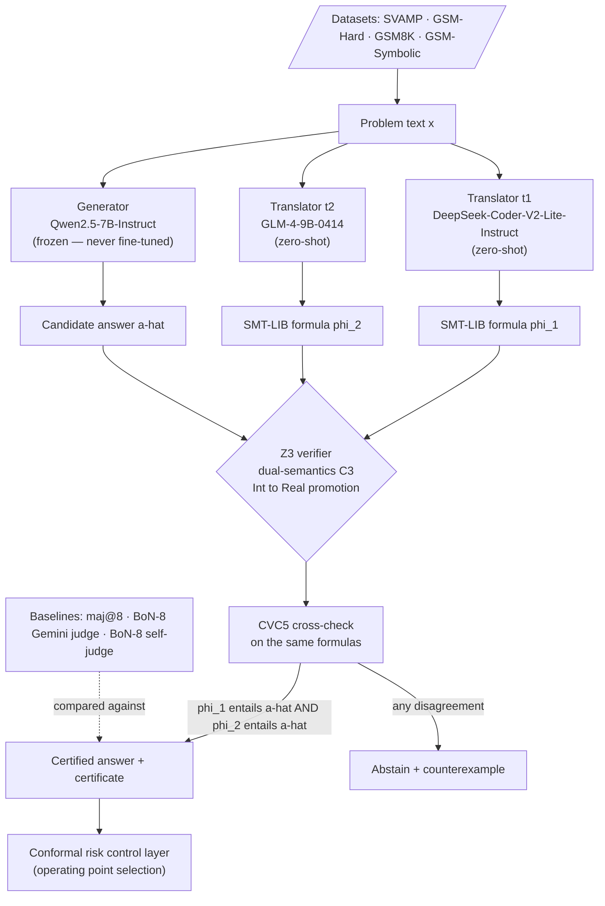

# Certified Selective Reasoning

### Decorrelated Neuro-Symbolic Verification with Distribution-Free Safety Guarantees

*A verification layer that lets a language model know **when to answer** — issuing a machine-checkable certificate when it does, and abstaining with a counterexample when it can't.*


---

> **The problem in one sentence.** Large language models are frequently *confidently wrong* on mathematical reasoning — and a wrong answer delivered with high confidence is far more dangerous than an honest "I don't know."
>
> **The idea in one sentence.** If you translate a problem into formal logic using **two autoformalizers drawn from different model families** and demand that *both* independently entail the generator's answer, the correlated errors that quietly defeat single-translator verifiers stop lining up — and the confident-wrong rate collapses toward zero.
>
> **The guarantee we target.** Not "this pipeline is provably sound." Rather: **two-tier conditional soundness** — the solver step is sound *given* a faithful translation, translation faithfulness is the named and bounded trust surface, and a conformal risk-control layer converts an observed confident-wrong rate into a distribution-free bound wherever exchangeability holds.

---

## ⚠️ Read this before the results tables

This project changed its deployed translator pair in July 2026. **The results banked so far were produced with the now-retired pair**, and are labelled as such throughout.

| | Configuration | Status |
|---|---|---|
| **Deployed pair** | `t₁` DeepSeek-Coder-V2-Lite-Instruct · `t₂` GLM-4-9B-0414 | Smoke-tested; full runs in progress (P1) |
| **Retired pair** | `t₁` Qwen2.5-Coder-7B-Instruct · `t₂` Mistral-7B-Instruct-v0.3 | Produced all banked numbers below; **retained deliberately** |

The retired pair is not deleted. Keeping four translator families (two deployed, two retired) over a shared set of banked problems is what makes the **cross-family error-correlation ρ** measurable across ≥4 family pairs — which is a contribution in its own right, not just housekeeping.

**No number in this README should be read as a result of the deployed pipeline until it is labelled `[deployed]`.** Nothing is yet.

---

## Table of Contents

- [Motivation: the confident-wrong problem](#motivation-the-confident-wrong-problem)
- [Core idea: decorrelated redundancy](#core-idea-decorrelated-redundancy)
- [Pipeline architecture](#pipeline-architecture)
- [The decision rule (and what it deliberately is not)](#the-decision-rule-and-what-it-deliberately-is-not)
- [Banked results (retired pair)](#banked-results-retired-pair)
- [Ablations and negative results](#ablations-and-negative-results)
- [Theory: the decorrelation bound](#theory-the-decorrelation-bound)
- [Statistical layer: conformal risk control and its scope](#statistical-layer-conformal-risk-control-and-its-scope)
- [Datasets and their roles](#datasets-and-their-roles)
- [Baselines](#baselines)
- [Pre-registered predictions](#pre-registered-predictions)
- [Success criteria for the full paper](#success-criteria-for-the-full-paper)
- [Repository structure](#repository-structure)
- [Installation](#installation)
- [Usage: the two-stage workflow](#usage-the-two-stage-workflow)
- [Reproducibility and engineering notes](#reproducibility-and-engineering-notes)
- [Compute budget](#compute-budget)
- [Roadmap](#roadmap)
- [Known blockers](#known-blockers)
- [Related work](#related-work)
- [Limitations and honest caveats](#limitations-and-honest-caveats)
- [Citation](#citation)
- [Contact](#contact)

---

## Motivation: the confident-wrong problem

Selective prediction asks a model to answer only when it is likely to be right, and to abstain otherwise. For high-stakes reasoning, the metric that matters is not accuracy but the **confident-wrong (CW) rate**: the fraction of *answered* problems on which the system commits to an incorrect answer. A deployable reasoning system should be able to make the CW rate arbitrarily small and *bound* it, trading coverage for safety in a controlled way.

Purely probabilistic confidence signals — softmax scores, self-consistency, learned verifiers — are calibrated at best on-distribution and offer no hard guarantee. This project takes a complementary route: **certify each answer symbolically**. We autoformalize the natural-language problem into an SMT formula and ask a solver whether the candidate answer is *entailed* by that formula. When it is, we emit a certificate; when it isn't, we abstain and return the solver's counterexample as a legible reason.

The catch — and the research contribution — is that a symbolic certificate is only as trustworthy as the **translation** that produced it. A single autoformalizer that misreads the problem will produce a formula that faithfully "certifies" the misreading. The central question is therefore:

> **How do we make the translation layer trustworthy enough that a symbolic certificate becomes a genuine safety signal — with guarantees that survive distribution shift?**

---

## Core idea: decorrelated redundancy

The thesis is **certified selective prediction via decorrelated redundancy**, and it rests on one observation confirmed repeatedly in our data:

> **Single-translator verification is structurally blind to correlated errors.** When the generator misreads a problem, a same-family translator tends to misread it *the same way*. The formula then entails the wrong answer and the verifier passes the error through — sometimes at *worse-than-chance* rates, because the very features that fool the generator fool its sibling translator too.

The remedy borrows from **N-version programming**: run independent implementations built by different teams and require agreement. Here the "implementations" are autoformalizers from **different model families**, and the "agreement" is a logical **AND-rule** — an answer is certified only if *every* translator's formula independently entails it.

Two design facts make this clean:

1. **The translators never see the generator's answer.** Each translator's formula depends only on the problem text `x`. Generation and translation are fully independent, which is what lets their errors be *decorrelated* rather than merely re-checked.
2. **Cross-family beats same-model k-way.** Adding more samples from the *same* family does not reduce CW, because errors correlate *within* a family. Decorrelation must come from architectural and data diversity across families — not from repetition. This is a measured negative result, reported in full below.

### Family disjointness invariant

Decorrelation is only credible if no organisation appears on both sides of a check. The role assignment is therefore constrained:

| Organisation | Permitted roles |
|---|---|
| Alibaba (Qwen) | Generator **only** |
| DeepSeek | Translator `t₁` + teacher 1 (conditional distillation track) |
| Zhipu (GLM) | Translator `t₂` + teacher 2 (conditional distillation track) |
| Google (Gemini) | Best-of-N judge + weak-to-strong oversight generator |

The retired pair violated this: the generator (`Qwen2.5-7B`) and `t₁` (`Qwen2.5-Coder-7B`) shared the Qwen lineage. Restoring disjointness is the primary reason for the July 2026 translator swap, and it means the banked cross-family numbers were measured under **residual family collusion** — i.e. under conditions less favourable than the deployed design.

---

## Pipeline architecture



**Stage 1 — Generation (GPU).** One frozen generator and two zero-shot translators run over the problem set. Because translation is answer-independent, we make **5 LLM passes** (1 generator + 2 translators, each optionally multi-sampled) rather than a 3×2 cross-product — every downstream ablation reuses these cached outputs. Raw outputs are checkpointed to JSONL.

**Stage 2 — Verification and metrics (CPU).** The verifier consumes cached formulas, applies the **dual-semantics C3 check** (with `Int→Real` promotion and an answer-variable fallback), cross-checks with CVC5, and computes coverage / CW / calibration under any decision rule. Stage 2 is *free*: verifier and metric changes require **no regeneration**, so ablations are cheap.

**Why the generator is frozen.** The generator's errors are the measurement substrate for the verifier's contribution. Fine-tuning it on GSM8K train would confound attribution — a drop in CW could then come from a stronger generator rather than from verification — and invites the obvious benchmark-tuning objection. The generator is therefore never PEFT-trained, by design and not by accident.

---

## The decision rule (and what it deliberately is not)

The decision rule is a **deterministic cross-family AND-rule**. An answer is released iff both translators' formulas independently entail it, confirmed by both solvers.

An earlier design used a **learned routing policy** to select operating points. **It was removed.** A trained router would make the certificate depend on a second learned component whose failure modes are opaque and whose training data overlaps the evaluation distribution — precisely the property the project exists to avoid. It also muddies the conformal analysis, because the router is fit on the same data the bound is calibrated on.

All operating-point flexibility now comes from the **conformal risk-control layer alone**. The certificate stays auditable: a reader can reconstruct exactly why any given answer was released, using only the two formulas and the solver.

---

## Banked results (retired pair)

> **Provenance.** Every table in this section was produced with `t₁ = Qwen2.5-Coder-7B-Instruct`, `t₂ = Mistral-7B-Instruct-v0.3`. These are the retired translators. Deployed-pair results are not yet available.
>
> *Coverage* = fraction of problems answered (not abstained). *CW* = confident-wrong count among answered problems. The design intent is **low CW at a chosen coverage**, not maximal coverage.

### 1. The decorrelation finding — GSM-Symbolic (n = 200)

| Configuration | Coverage | Confident-Wrong | Reading |
|---|---|---|---|
| Coder-only (`t₁`) | 56% | **8** | High coverage, correlated errors survive |
| Mistral-only (`t₂`) | 18% | **2** | Conservative alone, still non-zero CW |
| **Cross-family AND-rule** | **14%** | **0** | **Correlated errors broken — core result** |

Two single-translator verifiers each leak confident errors; requiring **both** — across families — leaves **zero observed CW** on this set. The price is coverage, which is precisely the selective-prediction trade we intend to expose and, ultimately, to bound.

> **Honest floor.** 14% coverage on n = 200 means only ~28 problems are answered. Zero errors over 28 trials gives, by the *rule of three*, a 95% upper bound on the *true* CW rate of ≈ **10.7%**. The observed CW = 0 is encouraging; the sample is small. This is exactly why the roadmap prioritises **pooling across datasets** for a defensible denominator and **conformal risk control** for a distribution-free bound rather than an empirical point estimate.

> **Sampling caveat.** This n = 200 slice is drawn from GSM-Symbolic, whose instances are generated from templates. Instances sharing a template are not independent, so the effective sample size is closer to the **number of distinct templates** than to 200. Cluster-aware intervals are required here and are applied in the full runs; the rule-of-three figure above is the more conservative reading and is the one we quote.

### 2. Blind-spot at scale — GSM8K test, refined-C3 (n = 1,319)

| Metric | Value | Interpretation |
|---|---|---|
| Coverage | 72.4% | Refined-C3 answers most problems |
| CW rate | 5.65% (76 cases) | Residual confident errors under a **single** translator |
| Strict-C3 rejections that are false abstentions | 89.3% | Strict C3 is too conservative; refined C3 recovers coverage |
| Nature of all 76 CW cases | shared semantic misreads | Generator error faithfully re-encoded by the translator |

Every one of the 76 confident-wrong cases is a **shared semantic misread** — the generator misunderstands the problem and the single translator encodes the *same* misunderstanding. This is the thesis demonstrated at full test-set scale: **single-translator verification cannot catch correlated errors.** It is the empirical motivation for the cross-family AND-rule.

### 3. Cross-model verified accuracy — GSM-Hard (n = 200, *superseded architecture*)

| Metric | Value |
|---|---|
| Verified accuracy @ 24% coverage | **97.9%** |

An early cross-model configuration reached 97.9% accuracy on its certified slice at 24% coverage. This result predates *even the retired pair* — `t₁` was Qwen self-translation at the time. It is reported as **directional evidence pending regeneration**, not as a result of any current system, and it is scheduled for a full re-run on the deployed pipeline in P1.

---

## Ablations and negative results

Negative results are first-class citizens here; they define the shape of the contribution.

- **Same-model k-way agreement does *not* reduce CW.** Requiring agreement among multiple samples from the *same* family leaves the CW rate essentially unchanged, because errors correlate within a family. This is the project's own thesis demonstrated against itself, and it is the empirical justification for going cross-family rather than simply sampling more. *(Confirmed on GSM-Hard.)*
- **Declarative translator prompt regressed coverage 56% → 42%.** A declarative all-SMT-style autoformalization prompt hurt coverage with no CW benefit and broke answer-variable naming. **Reverted permanently — do not re-introduce.**
- **`Check1` (tautology detection) was net-negative on GSM8K.** It removed 2 *correct* answers and caught 0 CW cases — a strict loss. Slated for removal or generalisation before submission.
- **PRM baseline disabled.** The process-reward-model baseline (`Qwen2.5-Math-PRM-7B`) produced all-NaN outputs and is offline. Probabilistic comparison is carried by self-consistency and best-of-N instead.

---

## Theory: the decorrelation bound

The planned theorem formalises the AND-rule as N-version redundancy over autoformalizers and bounds the certified error in terms of the **cross-family error correlation ρ**. Sketch:

```
Pr[CW]  ≤  ε₁·ε₂  +  ρ · √( ε₁(1−ε₁) · ε₂(1−ε₂) )
```

where `εᵢ` is the marginal unfaithful-translation rate of translator `i` and `ρ` is the correlation between their error indicators.

Reading it: at `ρ = 0` the bound collapses to the independent product `ε₁·ε₂` — the ideal case that motivates the whole design. As `ρ` rises the bound degrades **linearly**, with slope set by the geometric mean of the per-translator error variances. Cross-family diversity is thus not a heuristic; it is the quantity the bound is a function of.

Two extensions carry this from sketch to result:

- A **finite-sample version** via empirical-Bernstein / PAC-Bayes, so that a measured `ρ̂` on held-out data yields a usable bound rather than an asymptotic statement. This is what feeds the conformal layer.
- **Hardness-conditioned ρ.** GSM-Symbolic's repeated-measures template structure lets us estimate ρ *within* difficulty strata rather than pooled across them, which matters because error correlation is expected to rise on harder items — exactly where the guarantee is most load-bearing.

The empirical companion is a plot of **CW rate versus measured ρ** across translator-family pairs, turning "different families help" into a measured monotone relationship. The retained retired pair is what makes ≥4 family pairs available for this plot.

---

## Statistical layer: conformal risk control and its scope

Wrapping the verifier in **conformal risk control (CRC)** converts an *observed* CW rate into a **distribution-free bound** on the true CW rate. Certification uses pooled Wilson intervals, with rule-of-three treatment at the zero-error operating points.

**The scope restriction is not a formality.** Distribution-free bounds require calibration and test data to be exchangeable. That holds on **GSM8K test** and nowhere else in this study:

| Dataset | Bound status |
|---|---|
| GSM8K test | **CRC-certified.** Calibration/test exchangeability holds. |
| GSM-Hard | Robustness stress-test. Reported with intervals; **not CRC-certified.** |
| GSM-Symbolic (main / p1 / p2) | Template shift. **Cluster-aware CIs required** (effective n ≈ number of templates). Not CRC-certified. |
| SVAMP | Cross-corpus shift. Reported with intervals; **not CRC-certified.** |

Quoting a distribution-free guarantee on a shifted dataset would be a category error, and the paper does not do it. Shift datasets exist to show that the *mechanism* degrades gracefully, not to extend the *certificate*.

---

## Datasets and their roles

| Dataset | Size | Role | Licence note |
|---|---|---|---|
| **GSM8K train** | 7,473 | Sole training source (conditional distillation track only) | — |
| **GSM8K test** | 1,319 | In-distribution headline; the only CRC-certified surface | — |
| **GSM-Hard** | 1,319 | Magnitude shift — eval-only stress test | Bucket by exact string to avoid `float64` overflow collisions |
| **GSM-Symbolic** | main 5,000 · p1 5,000 · p2 2,500 | Template shift; source of hardness-conditioned ρ | **CC-BY-NC-ND-4.0** — we redistribute *regeneration scripts*, never derived JSONL |
| **SVAMP** | 1,000 | Cross-corpus shift; the only set where strict-vs-refined C3 divergence is meaningful (169/171 division problems have exact-integer quotients) | MIT |

**SVAMP has no legitimate train split.** Training on MAWPS or ASDiv-A would leak near-duplicate seed problems into the evaluation, so SVAMP stays strictly eval-only.

**Run order:** SVAMP → GSM-Hard → GSM8K → GSM-Symbolic main → p1/p2. Cheapest and most diagnostic first; the largest template sweep last.

---

## Baselines

The verifier must beat what a practitioner would actually reach for:

| Baseline | What it isolates |
|---|---|
| **maj@8** (self-consistency) | What repeated sampling from one model buys you |
| **Best-of-8, Gemini 3.1 Pro judge** | What a strong *external* probabilistic judge buys you |
| **Best-of-8, self-judge** | What the generator judging itself buys you — the correlation control |

The frontier API is assigned to a **role** (judge, and separately weak-to-strong oversight generator), not to a dataset. The evaluation pipeline runs identically across all datasets as local GPU jobs. Varying pipeline components per dataset would confound the distribution-shift axis and invalidate the pooled statistical denominator.

---

## Pre-registered predictions

Registered before the shift-dataset runs, and reported as stated whether or not they hold:

1. **Best-of-N's lift over majority vote shrinks on SVAMP.** Probabilistic reranking should lose more of its edge under cross-corpus shift than symbolic certification does.
2. **Single-translator CW concentrates in SVAMP's question-sensitivity category, and the AND-rule removes it disproportionately.** If the mechanism works the way we claim, its wins should be *categorically* located, not diffuse.
3. **CW rises monotonically with measured ρ.** The bound's central dependency, stated as a falsifiable empirical claim across ≥4 family pairs.

---

## Success criteria for the full paper

Stated in advance so the result can fail:

- **Pooled across all four evaluation sets:** AND-rule CW = 0 with a **cluster-aware 95% upper bound ≤ 0.15%**, against a projected pooled verified denominator of **2,700–4,300** answered problems.
- **≥10× CW reduction** versus single-translator verification, at **≤40% relative coverage loss**.
- **The conformal bound holds empirically at α = 1%** on GSM8K test.
- **Monotone CW–ρ relationship** across ≥4 translator-family pairs.

---

## Repository structure

```
.
├── README.md
├── requirements.txt
├── data/
│   ├── gsm8k/                 # 1,319 test (+ 7,473 train, distillation track only)
│   ├── gsm_hard/              # 1,319
│   ├── gsm_symbolic/          # regeneration scripts only — see licence note
│   └── svamp/                 # 1,000 (both splits concatenated)
├── src/
│   ├── stage1_generate.py     # GPU: generator + 2 translators -> raw_*.jsonl
│   ├── stage2_verify.py       # CPU: Z3/CVC5, decision rules, metrics
│   ├── translators/           # prompt templates, fence/preamble hardening
│   ├── verifier/              # SMT-LIB encoding, Int->Real promotion, C3 semantics
│   ├── decision_rules/        # single-translator | cross-family AND | maj@8 | BoN-8
│   ├── conformal/             # CRC calibration, pooled Wilson, rule-of-three
│   ├── correlation/           # rho estimation, hardness-conditioned strata
│   ├── metrics/               # coverage, CW, cluster-aware CIs, calibration
│   └── utils/                 # free_disk_for(), clean_code(), model loading
├── outputs/
│   ├── raw/                   # Stage-1 JSONL checkpoints
│   └── results/               # Stage-2 tables, plots, per-dataset breakdowns
├── configs/                   # model, quantization, dataset configs
└── docs/
    └── Reading_List_NeuroSymbolic_Verification.md   # 41-paper prior-work map
```

---

## Installation

```bash
git clone https://github.com/abhishekvicky12345/certified-selective-reasoning.git
cd certified-selective-reasoning
python -m venv .venv && source .venv/bin/activate
pip install -r requirements.txt
```

Core dependencies:

```bash
pip install torch transformers accelerate vllm bitsandbytes
pip install z3-solver cvc5
export HF_HUB_DISABLE_XET=1     # avoids a class of Hugging Face transfer failures
```

**Models** (Hugging Face IDs):

| Role | Model | Status |
|---|---|---|
| Generator | `Qwen/Qwen2.5-7B-Instruct` | Frozen — never fine-tuned |
| Translator `t₁` | `deepseek-ai/DeepSeek-Coder-V2-Lite-Instruct` | Deployed |
| Translator `t₂` | `THUDM/GLM-4-9B-0414` | Deployed |
| Translator `t₁` (retired) | `Qwen/Qwen2.5-Coder-7B-Instruct` | Retained for ρ measurement |
| Translator `t₂` (retired) | `mistral-community/Mistral-7B-Instruct-v0.3` | Retained for ρ measurement |
| BoN judge / oversight | Gemini 3.1 Pro (API) | Role-assigned |
| PRM baseline | `Qwen/Qwen2.5-Math-PRM-7B` | **Disabled** — all-NaN outputs |

**Quantization:** 4-bit NF4 with fp16 on Volta-class GPUs; bf16 on A100. Pin `bitsandbytes ≥ 0.46.1` for T4; avoid on Pascal/P100.

**Compute:** production runs target an **A100 (PCIe 40GB, ≥150GB disk)**; smoke tests run on a **T4**. Run a per-dataset smoke test (n = 40–200) before every full pass.

**On hosted APIs for open-weight models:** where a model is available as open weights, we self-host rather than calling a hosted endpoint. Self-hosting pins the exact weights, removes silent endpoint-side changes mid-study, and avoids third-party infrastructure dependencies in the reproducibility path.

---

## Usage: the two-stage workflow

```bash
# --- Stage 1: generation (GPU) -> raw_*.jsonl checkpoints ---
python src/stage1_generate.py \
    --dataset gsm_symbolic \
    --generator Qwen/Qwen2.5-7B-Instruct \
    --translators deepseek-ai/DeepSeek-Coder-V2-Lite-Instruct THUDM/GLM-4-9B-0414 \
    --out outputs/raw/gsm_symbolic/

# --- Stage 2: verification + metrics (CPU, free to re-run) ---
python src/stage2_verify.py \
    --raw outputs/raw/gsm_symbolic/ \
    --decision-rule cross_family_and \
    --c3-semantics refined \
    --cross-check cvc5 \
    --cluster-by template \
    --report outputs/results/gsm_symbolic/

# Ablations need no regeneration:
python src/stage2_verify.py --raw outputs/raw/gsm_symbolic/ --decision-rule t1_only ...
python src/stage2_verify.py --raw outputs/raw/gsm_symbolic/ --decision-rule maj8 ...
```

**The caching discipline (important):** delete a model's `raw_*.jsonl` **only** when its *producer* changes — the generation prompt, sampling settings, or model-load config. Verifier and metric changes are free and require only re-running Stage 2. This is what makes the ablation matrix cheap and the retired-pair comparison possible at all.

---

## Reproducibility and engineering notes

- **Independent generation/translation → 5 passes, not 6.** A translator's formula depends only on `x`, so the generator×translator cross-product is never needed.
- **Stage-1/Stage-2 split** separates expensive GPU work (checkpointed) from free CPU analysis (re-runnable), so every ablation reproduces without regeneration.
- **Robust parsing.** `clean_code` strips imperative tails; fence extraction is hardened against prose preambles; a system-role fallback folds any system prompt into the user turn for models without system-role support.
- **Disk hygiene.** `free_disk_for()` evicts stale artifacts before large downloads.
- **Large-magnitude answers** (GSM-Hard) are bucketed by **exact string** rather than float, to avoid `float64` overflow collisions.
- **Clustering.** Any statistic computed on GSM-Symbolic is clustered by template. Treating 5,000 instances as 5,000 independent draws would overstate precision by roughly the average template multiplicity.

---

## Compute budget

The full study is designed to run for **$160–355**, ceiling **$400**:

| Line item | Cost |
|---|---|
| Conditional teacher distillation | $80–180 |
| Best-of-8 Gemini 3.1 Pro judging | $50–115 |
| Weak-to-strong oversight generator | $10–15 |
| GPU (all Stage-1 passes + contingency + conditional fine-tuning) | $16–27 |
| Storage | $5–20 |

This is a claim, not an aside: **cheap trusted verification of an expensive untrusted model is practical today.** The entire empirical programme costs less than a conference registration.

---

## Roadmap

Status legend: ✅ done · 🔬 in progress · 📋 planned

**P0 — Infrastructure and banked results** ✅
Two-stage pipeline, checkpointing, retired-pair banked results, 41-paper reading list.

**P1 — Jul 20 → Aug 15** 🔬
Deployed-pair smoke tests · SVAMP full 1,000 · GSM-Hard full 1,319 (regeneration; supersedes the 97.9% number) · GSM8K test full 1,319 · first ρ estimates.

**P2 — Aug 15 → Sep 10** 📋
GSM-Symbolic main 5,000 + p1/p2 sweep · CRC calibration on GSM8K test · weak-to-strong oversight run · CVC5 cross-check across banked formulas.

**P3 — workshop paper** 📋
> ⚠️ **Timeline correction.** NeurIPS 2026 sets a mandatory workshop author-notification deadline of **29 September 2026**, which forces individual workshop submission deadlines into **late August** (trackers indicate ~30 August). The original plan assumed a 10–30 September writing window; that is too late. The workshop paper must be submission-ready by **mid-to-late August**, concurrent with P1/early-P2, resting on banked + P1 full-run results. **GSM-Symbolic main 5,000 will most likely not make the workshop version** and lands in arXiv v2 / the full paper instead.

**P4 — Oct 1 → Nov 15** 📋
Decorrelation theorem (finite-sample form) · CW-vs-ρ plot across ≥4 family pairs · conditional LoRA/teacher distillation track, gated on the blocker below.

**P5 — Nov 15 → Dec 15** 📋
arXiv v2 with full-scale results and the bound.

**P6 — → Mar 2027** 📋
Full paper, ICML 2027 (NeurIPS 2027 fallback).

**On the distillation track:** if pursued, it runs as **two independent parallel teacher tracks**, not a merged cascade. A merged cascade would give both students identical kept-sets, correlating their coverage gaps and raising ρ *at the data level* before training even begins — which would sabotage the one quantity the whole design depends on.

---

## Known blockers

| Blocker | Effect | Status |
|---|---|---|
| **LoRA label-masking bug** — flat-zero training loss | Blocks all PEFT / distillation tracks | Unresolved. The publishable pipeline is currently **zero-shot only**, which is arguably a strength: no distillation confound. |
| **Teacher model ID pinning** across preview→GA transitions | Reproducibility risk on the distillation track | Must be pinned before any teacher run |

If PEFT is eventually pursued, it is far better justified on the **translator** (a format-adherence problem) than on the **generator** (which would obscure whether gains come from the verifier or from a stronger model).

---

## Related work

Mapped against a **41-paper reading list** (`docs/Reading_List_NeuroSymbolic_Verification.md`). Selected anchors:

**Autoformalization & LLM + prover reasoning** — LINC (coupling LLMs with theorem provers); VeriCoT (verifying chain-of-thought via formal checks); Grammars of Formal Uncertainty (NeurIPS 2025), closely related on formal uncertainty in autoformalization.

**Calibration** — belief-tree propagation (BTProp); RLCR calibration.

**Guarantees, conformal prediction & safety** — Towards Guaranteed Safe AI (the GS-AI framework this work instantiates); compositional conformal prediction; conformal prediction and conformal risk control (Vovk; Angelopoulos & Bates).

**Foundations** — N-version programming (Avizienis) and PAC-Bayes (McAllester), the theoretical scaffolding for decorrelated redundancy.

*(Precise citation details are maintained in the reading-list document.)*

---

## Limitations and honest caveats

Stated plainly, because a certificate is only as credible as its caveats.

1. **Soundness is conditional, not end-to-end.** The solver is sound; the *system* is sound **only if** the autoformalization is faithful. The AND-rule hardens this empirically but does not make it unconditional. **No claim of a "provably sound pipeline" is made anywhere in this project.**
2. **`Int→Real` promotion tension.** The dual-semantics C3 check promotes integer sorts to reals to widen coverage. This is a known tension with strict soundness and is treated as an explicit assumption, not a free lunch.
3. **All banked results are from the retired translator pair.** Deployed-pair numbers do not yet exist. See the notice at the top.
4. **Small covered sets → wide intervals.** The CW = 0 result answers ~28 problems; the 95% upper bound on the true CW rate is ≈10.7% by the rule of three. Confidence intervals, not point estimates, are the honest currency here.
5. **Template dependence.** GSM-Symbolic instances are not independent. Effective sample size is closer to the template count than the instance count, and every statistic on it is clustered accordingly.
6. **Coverage is deliberately sacrificed.** This is selective prediction. Full-coverage accuracy is not the objective.
7. **Zero-shot only.** Fine-tuned translators are excluded pending the label-masking bug.
8. **Residual family collusion in the banked numbers.** The retired `t₁` shared the Qwen lineage with the generator. The deployed pair fixes this; the banked results were measured without the fix.
9. **The 97.9% GSM-Hard number is doubly superseded** — old architecture, old translator, n = 200. It awaits regeneration.
10. **The conformal bound is in progress.** Until it lands, the guarantee is *empirically hardened* rather than *distribution-free-bounded*, and the distinction is stated wherever results are reported.

---

## Citation

```bibtex
@misc{certified_selective_reasoning_2026,
  title  = {Certified Selective Reasoning: Decorrelated Neuro-Symbolic
            Verification with Distribution-Free Safety Guarantees},
  author = {Abhishek Kumar},
  year   = {2026},
  note   = {Manuscript in preparation},
  howpublished = {\url{https://github.com/abhishekvicky12345/certified-selective-reasoning}}
}
```

---

## Contact

**Abhishek Kumar** — Assistant Professor, KIET Group of Institutions, Ghaziabad
M.Tech (Artificial Intelligence), Delhi Technological University, 2023

Research interests: neuro-symbolic verification · certified selective prediction · trustworthy and guaranteed-safe AI

📧 `abhishekvicky12345@gmail.com`

*Results labelled "banked" are reproducible from cached Stage-1 artifacts via the Stage-2 pipeline. Results labelled "superseded" or "in progress" are marked as such throughout, and the translator pair that produced each number is stated explicitly.*

---

*Built with an emphasis on what a certificate can and cannot promise.*
